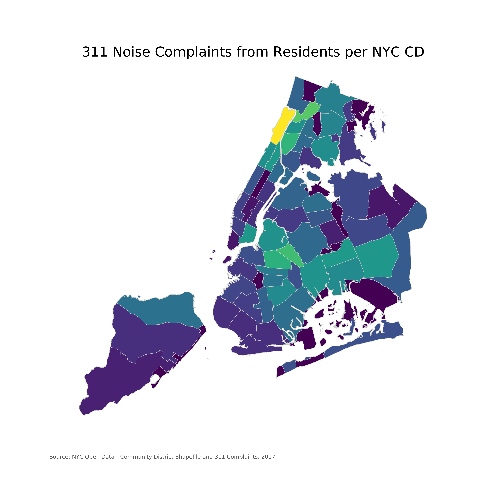

# Assignments
## Assignment 1

This map shows the total count of 311 noise complaints by residents in 2017 by Community District in NYC. If you look carefully, you might see that neighborhoods that were rapidly gentrifying in that time period have the highest complaint counts.

## Assignment 2

Finish your Citibike miniproject

Work with the same team with which you submitted the proposal and turn in a single report for the whole team. Use Authorea . If you worked in a group your team should have recieved more than one review, merge and discuss their content as apprioriate.
as a platform for delivery. 

Make an account on Authorea (free account). Authorea is a collaborative writing platform. In past years we used it for the capstone reports (but it was purchased by a corparate group since so we may dismiss it).

Finish the Citibike analysis you set up in HW4 in a notebook. Perform the appropriate statistical test. Incorporate your classmate's comment (from the review you recieved in HW5/6) where appropriate, and when you are not incorporating them discuss why the suggestions were not embraced (a few of you do not have a review yet, but I will upload one within the next few hours).

Write up a summary of the project as an Authorea article (a single article for your working team) which MUST includes:

#### Abstract - 
summary of idea and result

#### Introduction - 
a short introduction that explains what citibike is and why your question is interesting. Normally this would also include a discussion of similar work previously done (a literature review) but you do not have to worry about it now.

#### Data - 
a description of the data you use and how it is processed. This should include figures (with captions!!) that help visualize and understand the data.

#### Methodology - 
a description of the methodology (test) chosen, the motivation behind it, a discussion of alternative options that were not adopted. Either this session of the next one should contain figures as well to show the results.

#### Conclusions - 
The result and its significance, including the weaknesses and strengths of the analysis. Either this session of the previous one should contain figures as well to show the results.

Each session has to be included, each has to be written in plain English, full sentences. Each session should be between 50 and 100 words.

Incorporate the analysis notebook in the Authorea paper following these instructions and also upload it to your HW7_ repo

NOTES:

ACCEPT THE CLASSMATES PULL REQUESTS! a lot of you especially in the evening session have not! if the pull request is still pendind you will not get a grade for this portion and points will be deducted if the review is not uploaded and considered in your report (if you want to do a different test than recommanded that is fine, but it should be discussed in the report).

do not assume that the content of the review is right, wheather I commented on it or not! think for yourselves whether you want to incorporate it and justify it.

If you did not get a review by a classmate I am uploading a review for you.

There is some confusion about the various chi sq tests, including understandable confusion arising from the various flowcharts that help chosing tests. In general, if you want to test 2 proportions use the chi sq as we did for the ex-convict job reintegration exercise (most commonly called chi sq test for proportions)

There is some confusion about the word "parametric": a parametric test means a test that assumes something about the variables tested (often that they are Gaussian distributed). The data is not parametric, the data can follow a distribution or functional form, so that you can use a parametric test, or it does not (or you cannot tell) and then you should use a non-parametric test (or at least acknowledge that the test you use makes assumptions that may not be correct)

*Grading*

You will be graded on the quality of the writing, as well as the correctness of the analysis. You will also be graded on whether you have discussed and considered the recommandations of your "referees", the classmates that reviewed your proposal.
